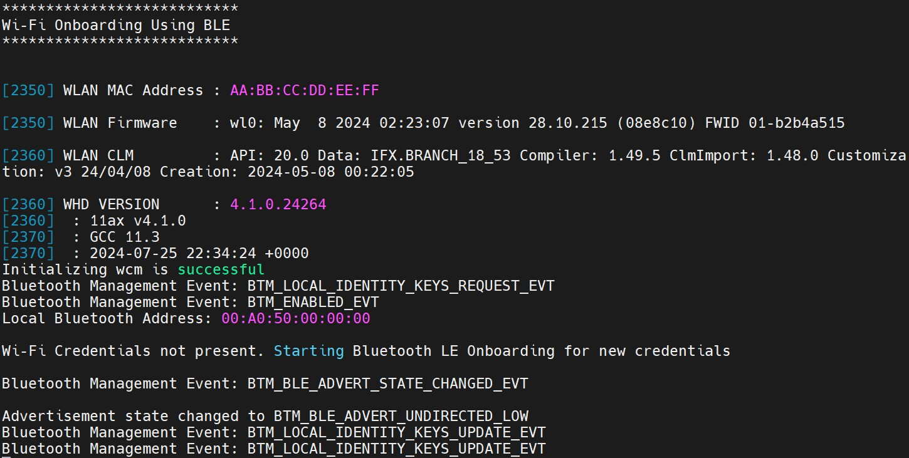
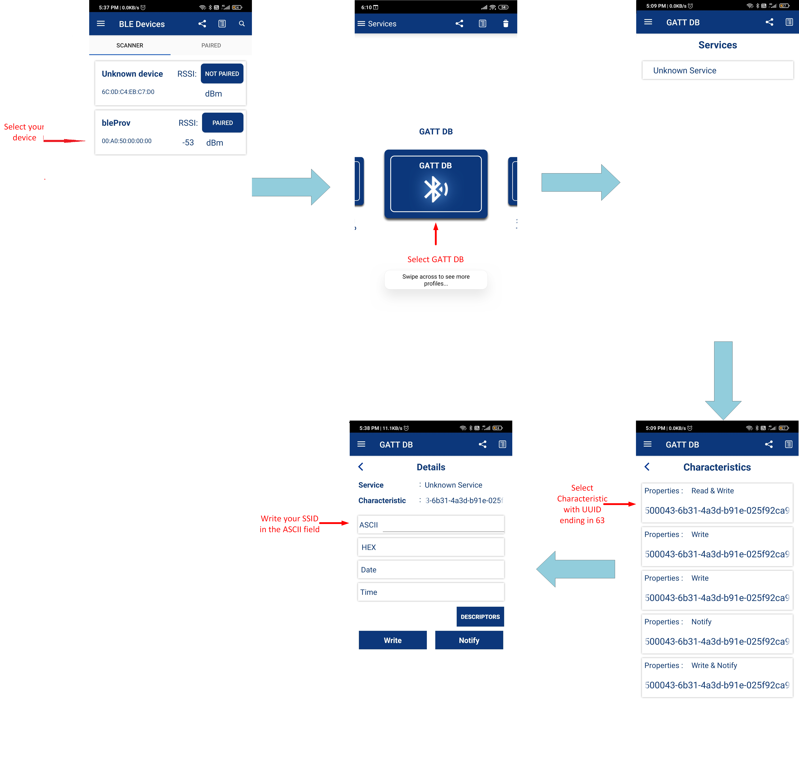
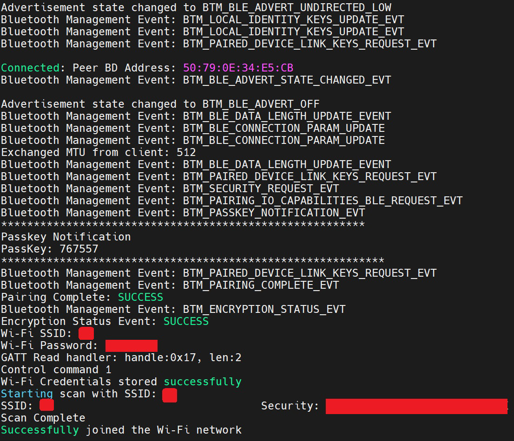
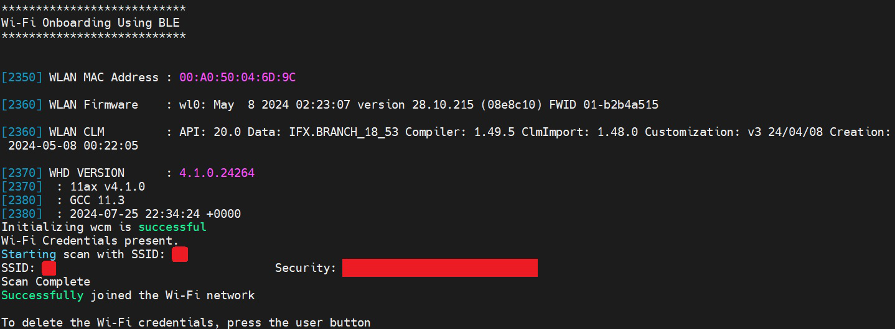
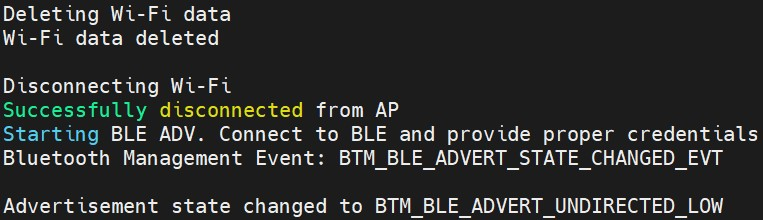

# Wi-Fi provisioning using Bluetooth&reg; LE

This code example uses the Infineon Wi-Fi onboarding custom service via Bluetooth&reg; LE for provisioning a new device to a Wi-Fi access point (AP). You can provide the service set identifier (SSID) and password to onboard the CYW955913EVK-01 kit to the Wi-Fi AP. It also allows scanning for available networks and disconnecting from already joined networks. For full service specifications refer to the document in the code example folder.

[View this README on GitHub.](https://github.com/Infineon/mtb-example-threadx-le-wifi-onboarding)

[Provide feedback on this code example.](https://cypress.co1.qualtrics.com/jfe/form/SV_1NTns53sK2yiljn?Q_EED=eyJVbmlxdWUgRG9jIElkIjoiQ0UyMzk2NDgiLCJTcGVjIE51bWJlciI6IjAwMi0zOTY0OCIsIkRvYyBUaXRsZSI6IldpLUZpIHByb3Zpc2lvbmluZyB1c2luZyBCbHVldG9vdGgmcmVnOyBMRSIsInJpZCI6InNoYWhzaHViaGFtcyIsIkRvYyB2ZXJzaW9uIjoiMS4xLjAiLCJEb2MgTGFuZ3VhZ2UiOiJFbmdsaXNoIiwiRG9jIERpdmlzaW9uIjoiTUNEIiwiRG9jIEJVIjoiSUNXIiwiRG9jIEZhbWlseSI6IldJRkkifQ==)


## Requirements

- [ModusToolbox&trade; software](https://www.infineon.com/modustoolbox) v3.2 or later (tested with v3.2) with ModusToolbox&trade;.
- Board support package (BSP) minimum required version for : v1.0.0.
- Programming language: C
- Associated parts: CYW955913EVK-01


## Supported toolchains (make variable 'TOOLCHAIN')

- GNU Arm&reg; Embedded Compiler v11.3.1 (`GCC_ARM`) – Default value of `TOOLCHAIN`

## Supported kits (make variable 'TARGET')
- [CYW955913EVK-01 Wi-Fi Bluetooth&reg; Prototyping Kit](https://www.infineon.com/CYW955913EVK-01) (`CYW955913EVK-01`)


## Hardware setup

This example uses the kit’s default configuration. See the respective kit guide to ensure that the kit is configured correctly.


## Software setup

See the [ModusToolbox&trade; tools package installation guide](https://www.infineon.com/ModusToolboxInstallguide) for information about installing and configuring the tools package.

Install a terminal emulator if you don't have one. instructions in this document use [Tera Term](https://teratermproject.github.io/index-en.html). 

This example requires no additional software or tools.

> **Note:** This code example consists of two parts: Bluetooth&reg; LE GAP Peripheral and Bluetooth&reg; LE GAP Central.

For Bluetooth&reg; LE GAP Central, download and install the AIROC&trade; Bluetooth&reg; Connect App for [Android](https://play.google.com/store/apps/details?id=com.infineon.airocbluetoothconnect) or [iOS](https://apps.apple.com/in/app/airoc-bluetooth-connect-app/id6443702288).

Scan the following QR code on your mobile phone to download the AIROC&trade; Bluetooth&reg; Connect App.

**Figure 1. QR codes to download the AIROC&trade; Bluetooth&reg; Connect App**


## Using the code example

### Create the project

The ModusToolbox&trade; tools package provides the Project Creator as both a GUI tool and a command line tool.

<details><summary><b>Use Project Creator GUI</b></summary>

1. Open the Project Creator GUI tool.

   There are several ways to do this, including launching it from the dashboard or from inside the Eclipse IDE. For more details, see the [Project Creator user guide](https://www.infineon.com/ModusToolboxProjectCreator) (locally available at *{ModusToolbox&trade; install directory}/tools_{version}/project-creator/docs/project-creator.pdf*).

2. On the **Choose Board Support Package (BSP)** page, select a kit supported by this code example. See [Supported kits](#supported-kits-make-variable-target).

   > **Note:** To use this code example for a kit not listed here, you may need to update the source files. If the kit does not have the required resources, the application may not work.

3. On the **Select Application** page:

   a. Select the **Applications(s) Root Path** and the **Target IDE**.

   > **Note:** Depending on how you open the Project Creator tool, these fields may be pre-selected for you.

   b.	Select this code example from the list by enabling its check box.

   > **Note:** You can narrow the list of displayed examples by typing in the filter box.

   c. (Optional) Change the suggested **New Application Name** and **New BSP Name**.

   d. Click **Create** to complete the application creation process.

</details>

<details><summary><b>Use Project Creator CLI</b></summary>

The 'project-creator-cli' tool can be used to create applications from a CLI terminal or from within batch files or shell scripts. This tool is available in the *{ModusToolbox&trade; install directory}/tools_{version}/project-creator/* directory.

Use a CLI terminal to invoke the 'project-creator-cli' tool. On Windows, use the command-line 'modus-shell' program provided in the ModusToolbox&trade; installation instead of a standard Windows command-line application. This shell provides access to all ModusToolbox&trade; tools. You can access it by typing 'modus-shell' in the search box in the Windows menu. In Linux and macOS, you can use any terminal application.

The following example clones the "[mtb-example-threadx-ble-wifi-onboarding](https://github.com/Infineon/mtb-example-threadx-ble-wifi-onboarding)" application with the desired name "BluetoothLEProvisioning" configured for the *CYW955913EVK-01* BSP into the specified working directory, *C:/mtb_projects*:

   ```
   project-creator-cli --board-id CYW955913EVK-01 --app-id mtb-example-threadx-ble-wifi-onboarding --user-app-name BluetoothLEProvisioning --target-dir "C:/mtb_projects"
   ```

The 'project-creator-cli' tool has the following arguments:

Argument | Description | Required/optional
---------|-------------|-----------
`--board-id` | Defined in the <id> field of the [BSP](https://github.com/Infineon?q=bsp-manifest&type=&language=&sort=) manifest | Required
`--app-id`   | Defined in the <id> field of the [CE](https://github.com/Infineon?q=ce-manifest&type=&language=&sort=) manifest | Required
`--target-dir`| Specify the directory in which the application is to be created if you prefer not to use the default current working directory | Optional
`--user-app-name`| Specify the name of the application if you prefer to have a name other than the example's default name | Optional

<br>

> **Note:** The project-creator-cli tool uses the `git clone` and `make getlibs` commands to fetch the repository and import the required libraries. For details, see the "Project creator tools" section of the [ModusToolbox&trade; tools package user guide](https://www.infineon.com/ModusToolboxUserGuide) (locally available at {ModusToolbox&trade; install directory}/docs_{version}/mtb_user_guide.pdf).

</details>


### Open the project

After the project has been created, you can open it in your preferred development environment.


<details><summary><b>Eclipse IDE</b></summary>

If you opened the Project Creator tool from the included Eclipse IDE, the project will open in Eclipse automatically.

For more details, see the [Eclipse IDE for ModusToolbox&trade; user guide](https://www.infineon.com/MTBEclipseIDEUserGuide) (locally available at *{ModusToolbox&trade; install directory}/docs_{version}/mt_ide_user_guide.pdf*).

</details>


<details><summary><b>Visual Studio (VS) Code</b></summary>

Launch VS Code manually, and then open the generated *{project-name}.code-workspace* file located in the project directory.

For more details, see the [Visual Studio Code for ModusToolbox&trade; user guide](https://www.infineon.com/MTBVSCodeUserGuide) (locally available at *{ModusToolbox&trade; install directory}/docs_{version}/mt_vscode_user_guide.pdf*).

</details>

  


<details><summary><b>Command line</b></summary>

If you prefer to use the CLI, open the appropriate terminal, and navigate to the project directory. On Windows, use the command-line 'modus-shell' program; on Linux and macOS, you can use any terminal application. From there, you can run various `make` commands.

For more details, see the [ModusToolbox&trade; tools package user guide](https://www.infineon.com/ModusToolboxUserGuide) (locally available at *{ModusToolbox&trade; install directory}/docs_{version}/mtb_user_guide.pdf*).

</details>


## Operation

1. Connect the board to your PC using the provided USB cable through the KitProg3 USB connector.

2. Open a terminal program and select the KitProg3 COM port. Set the serial port parameters to 8N1 and 115200 baud.

3. Program the board using one of the following:

   <details><summary><b>Using Eclipse IDE</b></summary>

   1. Select the application project in the Project Explorer.

   2. In the **Quick Panel**, scroll down, and click **\<Application Name> Program**.
   </details>


   <details><summary><b>In other IDEs</b></summary>

   Follow the instructions in your preferred IDE.
   </details>


   <details><summary><b>Using CLI</b></summary>

      From the terminal, execute the `make program` command to build and program the application using the default toolchain to the default target. The default toolchain is specified in the application's Makefile but you can override this value manually:
   ```
   make program TOOLCHAIN=<toolchain>
   ```

   Example:
   ```
   make program TOOLCHAIN=GCC_ARM
   ```
   </details>

4. After programming, the application doesn't start automatically. Press the reset button on the EVK. Observe the messages on the UART terminal and wait for the device to initialize Bluetooth&reg; stack and Wi-Fi.

   The device initializes the Bluetooth&reg; stack and starts advertisement.

   **Figure 1. Boot-up log**
   
   

5. Do the following to test using the AIROC&trade; Bluetooth&reg; Connect App mobile application:

    1. Turn **ON** Bluetooth&reg; on your Android or iOS device.

    2. Launch the AIROC&trade; Bluetooth&reg; Connect App.

    3. Press reset button on the kit to start sending advertisements.

    4. Swipe down on the AIROC&trade; Bluetooth&reg; Connect App home screen to start scanning for Bluetooth&reg; LE Peripherals. Your device (**bleProv**) appears in the AIROC&trade; Bluetooth&reg; Connect App home screen. Select your device to establish a Bluetooth&reg; LE connection.

    5. Select the **Generic Attribute Profile database** (GATT DB) profile from the carousel view and then select **Unknown Service**.

    6. To scan for the available Wi-Fi networks, enable the notifications in the characteristic with **Universally Unique Identifier** (UUID) ending in **66**, then select the characteristic with UUID ending in **67** and select **Notify**. Write hex value **2** to this characteristic. 
    
        The device will start scanning and send the network details as notifications in the characteristic with UUID ending in **66**. The data is in the Type, Length, Value (TLV) format. The first byte gives the type which is **1** for SSID and **2** for security details. The second byte gives the length of the data. After this data, there will be another type byte followed by length and data. The security value consists of 4 bytes (little-endian) which needs to be combined into a 32-bit value.

         > **Note:** If the notifications are not enabled in the characteristic with UUID ending in 66 the scan does not start as there is no way to report available networks to the user. The user can still connect to a network by entering the Wi-Fi SSID (in UUID ending with 63), password (in UUID ending with 64), and then initiate a connect request by writing '1' in the Wi-Fi control characteristic (in UUID ending with 67).

    7. To connect to the Wi-Fi network, send the SSID and password data to the client device. Select one of the networks which was discovered during scan or give another set of details. If the given network is not available then the device will store the values and try to connect on the next restart. Note that the data is stored in external flash only when the connect command is sent. The Wi-Fi credentials can be sent by either sending the Wi-Fi SSID and password separately or together.

       1. Sending the SSID and password separately:
           1. Select the UUID ending in 63. Write the Wi-Fi SSID in hex or ASCII format.
           2. Select the UUID ending in 64. Write the Wi-Fi password in hex or ASCII format.
       2. Sending the SSID and password together:
           1. Format the SSID and password data in TLV format. For SSID, the type value is '1' and for password, the type value is '2'. The first byte of the data should be type and for this example it will be '1' for SSID followed by length of the SSID and then the SSID data which is in hex format. This is followed by TLV value for password. For example, if the SSID is Wi-FiSSID and password is PASSWORD then the formatted value will be:

               ```
               01 08 57 49 46 49 53 53 49 44 02 08 50 41 53 53 57 4f 52 44
            
               ```
           2. Select the UUID ending in 65 and write your formatted data.

    8. If you are sending SSID and password separately then it is easier to input the data directly in the ASCII format. If you are sending them together then use the hex format, as the type and length values are in hex format.

       > **Note:** You can use an online tool for converting the SSID and password from string to hex format but be aware of where you type in your password.


       **Figure 2. AIROC&trade; Bluetooth&reg; Connect App flow**

       

    9. Select the attribute with the UUID ending in **67**. Select **Notify** (if not done earlier). Write hex value '1' to this characteristic to connect to the Wi-Fi network. If the connection is successful then the server will send a notification with value '1' otherwise with value '0'.

       **Figure 3. Connection log**

       

6. Once the Wi-Fi SSID and password is provided by the client, it is stored in the external flash. 

7. The device can use this data upon reset to connect to an AP without requiring Bluetooth&reg; LE intervention. 

   **Figure 4. KV-Store Capability**

   

8. Press the user button to remove the Wi-Fi credentials from the external flash. Once deleted, you can input and save the new credentials by following the steps from 5 onwards.

   **Figure 5. Deleting Wi-Fi Credentials**

   
 

## Debugging

You can debug the example to step through the code.

<details><summary><b>In Eclipse IDE</b></summary>

Use the **\<Application Name> Attach (KitProg3_MiniProg4)** configuration in the **Quick Panel**. For details, see the "Program and debug" section in the [Eclipse IDE for ModusToolbox&trade; user guide](https://www.infineon.com/MTBEclipseIDEUserGuide).


</details>


<details><summary><b>In other IDEs</b></summary>

Follow the instructions in your preferred IDE.

</details>

For Bluetooth HCI logs set `ENABLE_SPY_TRACES = 1` in the makefile. You can use [BTSPY](https://github.com/Infineon/btsdk-utils) utility to view the SPY logs and debug protocol related issues. Refer [AIROC&trade; HCI Transport readme](https://github.com/Infineon/airoc-hci-transport/blob/master/README.md#quick-start) for more details.

## Design and implementation

In this example, Bluetooth&reg; LE provides a mechanism for the device to connect to a Wi-Fi AP by providing the Wi-Fi SSID and password in a secure manner. The Wi-Fi credentials are stored in external flash so that the device can use this data upon reset to connect to an AP without requiring Bluetooth&reg; LE intervention. Note that the data stored in the extrenal flash is unencrypted.


The Wi-Fi SSID and password are exchanged using custom GATT service and characteristics. There are a few characteristics to send the SSID and password. The first two are used to send the SSID and password separately and the third is used to send the data together as described previously. The fourth characteristic is to receive Wi-Fi network details when the device is asked to scan for networks. There is a fifth custom characteristic, which gives the command to connect, disconnect and scan. Only the Wi-Fi SSID characteristic is readable; all others are either writable or notifiable or both. The device needs to be paired before any characteristic can be read from or written to.

**Table 1. Application source files**

**File name**            |**Comments**      
------------------------|---------------------------------------
*main.c* | Has the application entry function. It initializes the UART for debugging and then initializes the controller stack. It handles Bluetooth&reg; LE initialization, configuration, advertisement, and responses to Bluetooth&reg; LE events.
*wifi_task.c* | It contains the *wifi_task* which helps to connect or disconnect to or from the Wi-Fi AP based on the Wi-Fi SSID and password provided.
*app_utils.c* | Has some utility functions which help to convert return and status values to meaningful texts.

<br>

**Table 2. Functions in *main.c* file**

 **Function name** | **Functionality** 
-------------------|-------------------
 `main` | This is the main function for the CM33 CPU. It does the following: <br> 1. Initializes the BSP <br> 2. Enables global interrupt <br> 3. Initializes Retarget IO <br> 4. Initializes platform configuration <br> 5. Creates Wi-Fi connect and disconnect tasks
| `application_init` |This function is called from the BTM enabled event, and does the following: <br> 1. Creates a WICED heap <br> 2. Initializes button GPIO, enable interrupt and register callback <br> 3. Checks if Wi-Fi credential data is available in the external flash <br> 4. Initializes and registers the GATT DB <br> 5. Sets pairable mode to `TRUE` <br> 6. Sets Adv data and starts advertising 
`app_management_cback` | Handles Bluetooth&reg; stack events 
`app_get_attribute` | Searches through the GATT DB to point to the attribute corresponding to the given handle 
`app_gatts_req_read_handler` | Handles GATT read request events from Bluetooth&reg; stack 
`app_gatt_read_by_type_handler` | Handles GATT read by type requests 
`app_gatts_req_write_handler` | Handles GATT write request events from Bluetooth&reg; stack 
`app_gatt_connect_callback` | Handles GATT connect request events from Bluetooth&reg; stack 
`app_gatts_req_cb` | Redirects GATT attribute requests to the appropriate functions 
`app_gatts_callback` | This is the callback function for GATT events that is registered when the GATT database is initialized in the BTM enabled event.
`gpio_interrupt_handler` | GPIO interrupt service routine. This function detects button presses, deletes the Wi-Fi data from the external flash, and starts Bluetooth&reg; LE Adv. 

<br>

**Table 3. Functions in *wifi_task.c* file**

**Function name** | **Functionality** 
-------------------|-------------------
`wifi_task` | Initializes the WCM module and connects disconnects to/from the AP as well as starts Wi-Fi scan 
`scan_callback` | The callback function which accumulates the scan results 

<br>

### Bluetooth&reg; LE GATT custom service

This example uses custom GATT service and characteristics to communicate with the Bluetooth&reg; LE GATT client. The GATT database is created using the Bluetooth&reg; Configurator. The configurator generates files called *cycfg_gatt_db.c* and *cycfg_gatt_db.h* which contain the GATT DB. See the *{ModusToolbox install directory}/tools_{version}/bt-configurator/docs/bt-configurator.pdf* to create a GATT database.

The custom characteristics used in this example is detailed in the specification called 'Infineon Wi-Fi onboarding service (IWOS)' (file name: *002-33722_0A_S.pdf* included with this code example).


### Resources and settings

This section explains the ModusToolbox&trade; resources and their configurations as used in this code example. Note that all the configurations explained in this section have already been done in this code example. The ModusToolbox&trade; IDE stores the configuration settings of the application in the *design.modus* file. This file is used by the graphical configurators, which generate the configuration firmware. This firmware is stored in the application’s *GeneratedSource* folder.

- **Device Configurator:** The Device Configurator is used to enable/configure the peripherals and the pins used in the application. See
[Device Configurator guide](https://www.infineon.com/ModusToolboxDeviceConfig).

- **Bluetooth&reg; Configurator:** The Bluetooth&reg; Configurator is used for generating/modifying the Bluetooth&reg; LE GATT database. See
[Bluetooth&reg; Configurator guide](https://www.infineon.com/ModusToolboxBLEConfig).


## Related resources

Resources  | Links
-----------|----------------------------------
Application notes  |Contact [Infineon Support](https://www.infineon.com/cms/en/about-infineon/company/contacts/support/) for device application notes.
Code examples  | [Using ModusToolbox&trade;](https://github.com/Infineon/Code-Examples-for-ModusToolbox-Software) on GitHub <br>
Device documentation |Contact [Infineon Support](https://www.infineon.com/cms/en/about-infineon/company/contacts/support/) for device documentation.
Development kits | Select your kits from the [Evaluation board finder](https://www.infineon.com/cms/en/design-support/finder-selection-tools/product-finder/evaluation-board)
Libraries on GitHub  | [mtb-pdl-cat5](https://github.com/Infineon/mtb-pdl-cat5) – Peripheral Driver Library (PDL) <br> [mtb-hal-cat5](https://github.com/Infineon/mtb-hal-cat5) – Hardware Abstraction Layer (HAL) library <br> [retarget-io](https://github.com/Infineon/retarget-io) – Utility library to retarget STDIO messages to a UART port <br> 
Tools  | [ModusToolbox&trade;](https://www.infineon.com/modustoolbox) – ModusToolbox&trade; software is a collection of easy-to-use libraries and tools enabling rapid development with Infineon MCUs for applications ranging from wireless and cloud-connected systems, edge AI/ML, embedded sense and control, to wired USB connectivity using PSoC&trade; Industrial/IoT MCUs, AIROC&trade; Wi-Fi and Bluetooth&reg; connectivity devices, XMC&trade; Industrial MCUs, and EZ-USB&trade;/EZ-PD&trade; wired connectivity controllers. ModusToolbox&trade; incorporates a comprehensive set of BSPs, HAL, libraries, configuration tools, and provides support for industry-standard IDEs to fast-track your embedded application development.

<br>


## Other resources

Infineon provides a wealth of data at [www.infineon.com](https://www.infineon.com) to help you select the right device, and quickly and effectively integrate it into your design.


## Document history

Document title: *CE239648* - *Wi-Fi provisioning using Bluetooth&reg; LE*

Version | Description of change
------- | ---------------------
| 1.0.0   | New code example   |
| 1.1.0   | Added functionality to store credentials in External flash    |

<br>

All referenced product or service names and trademarks are the property of their respective owners.

The Bluetooth&reg; word mark and logos are registered trademarks owned by Bluetooth SIG, Inc., and any use of such marks by Infineon is under license.


---------------------------------------------------------

© Cypress Semiconductor Corporation, 2024. This document is the property of Cypress Semiconductor Corporation, an Infineon Technologies company, and its affiliates ("Cypress").  This document, including any software or firmware included or referenced in this document ("Software"), is owned by Cypress under the intellectual property laws and treaties of the United States and other countries worldwide.  Cypress reserves all rights under such laws and treaties and does not, except as specifically stated in this paragraph, grant any license under its patents, copyrights, trademarks, or other intellectual property rights.  If the Software is not accompanied by a license agreement and you do not otherwise have a written agreement with Cypress governing the use of the Software, then Cypress hereby grants you a personal, non-exclusive, nontransferable license (without the right to sublicense) (1) under its copyright rights in the Software (a) for Software provided in source code form, to modify and reproduce the Software solely for use with Cypress hardware products, only internally within your organization, and (b) to distribute the Software in binary code form externally to end users (either directly or indirectly through resellers and distributors), solely for use on Cypress hardware product units, and (2) under those claims of Cypress’s patents that are infringed by the Software (as provided by Cypress, unmodified) to make, use, distribute, and import the Software solely for use with Cypress hardware products.  Any other use, reproduction, modification, translation, or compilation of the Software is prohibited.
<br>
TO THE EXTENT PERMITTED BY APPLICABLE LAW, CYPRESS MAKES NO WARRANTY OF ANY KIND, EXPRESS OR IMPLIED, WITH REGARD TO THIS DOCUMENT OR ANY SOFTWARE OR ACCOMPANYING HARDWARE, INCLUDING, BUT NOT LIMITED TO, THE IMPLIED WARRANTIES OF MERCHANTABILITY AND FITNESS FOR A PARTICULAR PURPOSE.  No computing device can be absolutely secure.  Therefore, despite security measures implemented in Cypress hardware or software products, Cypress shall have no liability arising out of any security breach, such as unauthorized access to or use of a Cypress product. CYPRESS DOES NOT REPRESENT, WARRANT, OR GUARANTEE THAT CYPRESS PRODUCTS, OR SYSTEMS CREATED USING CYPRESS PRODUCTS, WILL BE FREE FROM CORRUPTION, ATTACK, VIRUSES, INTERFERENCE, HACKING, DATA LOSS OR THEFT, OR OTHER SECURITY INTRUSION (collectively, "Security Breach").  Cypress disclaims any liability relating to any Security Breach, and you shall and hereby do release Cypress from any claim, damage, or other liability arising from any Security Breach.  In addition, the products described in these materials may contain design defects or errors known as errata which may cause the product to deviate from published specifications. To the extent permitted by applicable law, Cypress reserves the right to make changes to this document without further notice. Cypress does not assume any liability arising out of the application or use of any product or circuit described in this document. Any information provided in this document, including any sample design information or programming code, is provided only for reference purposes.  It is the responsibility of the user of this document to properly design, program, and test the functionality and safety of any application made of this information and any resulting product.  "High-Risk Device" means any device or system whose failure could cause personal injury, death, or property damage.  Examples of High-Risk Devices are weapons, nuclear installations, surgical implants, and other medical devices.  "Critical Component" means any component of a High-Risk Device whose failure to perform can be reasonably expected to cause, directly or indirectly, the failure of the High-Risk Device, or to affect its safety or effectiveness.  Cypress is not liable, in whole or in part, and you shall and hereby do release Cypress from any claim, damage, or other liability arising from any use of a Cypress product as a Critical Component in a High-Risk Device. You shall indemnify and hold Cypress, including its affiliates, and its directors, officers, employees, agents, distributors, and assigns harmless from and against all claims, costs, damages, and expenses, arising out of any claim, including claims for product liability, personal injury or death, or property damage arising from any use of a Cypress product as a Critical Component in a High-Risk Device. Cypress products are not intended or authorized for use as a Critical Component in any High-Risk Device except to the limited extent that (i) Cypress’s published data sheet for the product explicitly states Cypress has qualified the product for use in a specific High-Risk Device, or (ii) Cypress has given you advance written authorization to use the product as a Critical Component in the specific High-Risk Device and you have signed a separate indemnification agreement.
<br>
Cypress, the Cypress logo, and combinations thereof, ModusToolbox, PSoC, CAPSENSE, EZ-USB, F-RAM, and TRAVEO are trademarks or registered trademarks of Cypress or a subsidiary of Cypress in the United States or in other countries. For a more complete list of Cypress trademarks, visit [www.infineon.com](https://www.infineon.com). Other names and brands may be claimed as property of their respective owners.
